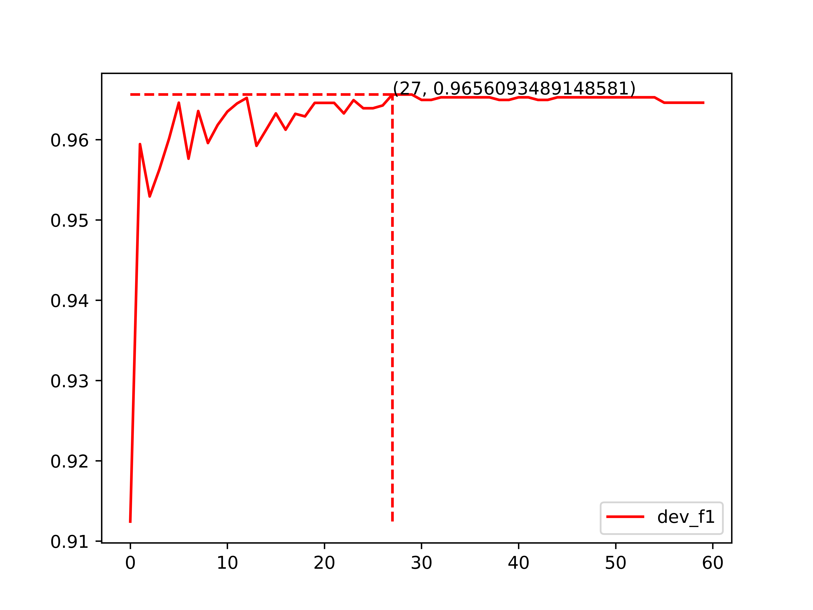
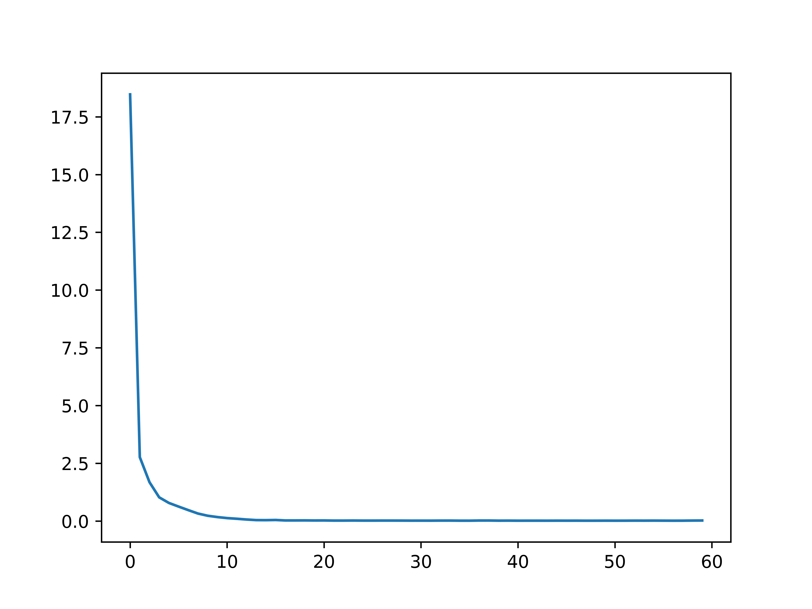

# 基于BERT-BiLSTM-CRF的中文简历命名实体识别

## 数据集介绍

本项目采用的数据集是论文ACL 2018 Chinese NER Using Lattice LSTM中收集的简历数据，包括训练集、验证集和测试集，采用BMES标注。训练集共包含127920个有效字符、3821个句子，验证集包含13952个有效字符、464个句子，测试集包含15129个有效字符、477个句子。

我们将所有的实体分为姓名（NAME）、国籍（CONT）、职务（TITLE）、组织机构（ORG）、籍贯（LOC）、民族（RACE）、学历（EDU）和专业（PRO）八类，并采用BIO策略标注各类实体，其中“B”表示实体的开始字符，“I”表示实体非开始字符，“O”表示非实体字符。考虑到CRF解码所需的<start>、<end>以及数据预处理过程中引入的填充字符，待预测标签共有20种。

| 实体类型 | 训练集 | 验证集 | 测试集 |
| -------- | ------ | ------ | ------ |
| NAME     | 861    | 102    | 112    |
| CONT     | 260    | 33     | 28     |
| TITLE    | 6308   | 692    | 770    |
| ORG      | 4610   | 523    | 553    |
| LOC      | 47     | 2      | 6      |
| RACE     | 112    | 14     | 14     |
| EDU      | 858    | 106    | 112    |
| PRO      | 287    | 18     | 33     |
| 总计     | 13438  | 1499   | 1628   |

## 原始数据样例
```
高 B-NAME
勇 E-NAME
： O
男 O
， O
中 B-CONT
国 M-CONT
国 M-CONT
籍 E-CONT
， O
无 O
境 O
外 O
居 O
留 O
权 O
， O

1 O
9 O
```
## 转换为csv文件
原始的训练集、验证集和测试集格式均为一行一个字符和标签，且采用BMES标注，难以进行统计和分析，需要先运行txt2csv.py，将其转换成结构化程度较高的csv格式数据并将BMES标注转换为BIO标注，示例如下。

| sen | label_decode | label（前后加了[cls]和[sep]） | raw_sen | length|
| ---- | ---- |---- |---- |---- |
|['高', '勇', '：', '男', '，', '中', '国', '国', '籍', '，', '无', '境', '外', '居', '留', '权', '，']|['B-NAME', 'I-NAME', 'O', 'O', 'O', 'B-CONT', 'I-CONT', 'I-CONT', 'I-CONT', 'O', 'O', 'O', 'O', 'O', 'O', 'O', 'O']|[5, 3, 4, 5, 5, 5, 6, 7, 7, 7, 5, 5, 5, 5, 5, 5, 5, 5, 5]|高勇：男，中国国籍，无境外居留权，|17|


## 代码结构
```
BERT_BiLSTM_CRF_ResumeNER/
├── data                                     # 存放数据的默认目录
│   ├── cner
│   │    ├── bert_dev_f1.png              # 训练过程中验证集的F1分数变化曲线
│   │    ├── bert_loss.png                # 训练过程中训练集损失下降曲线
│   │    ├── test_data_predict.csv           # 测试集数据及预测结果
│   │    ├── label_2_id.json                 # 标签与对应id的映射
│   │    ├── train.char.bmes                 # 原始训练集，由txt2csv.py转换为train.csv
│   │    ├── test.char.bmes                  # 原始测试集，由txt2csv.py转换为test.csv
│   │    ├── dev.char.bmes                   # 原始验证集，由txt2csv.py转换为dev.csv
│   │    ├── train.csv                       # 训练集
│   │    ├── test.csv                        # 测试集
│   │    └── dev.csv                         # 验证集
│   └── txt2csv.py                           # 将原始数据集转换为相应的csv文件
├── models  					# 训练过程中得到的最优模型默认保存在此目录下 
├── config.py                   # 超参数配置
├── dataset.py                  # 数据预处理，使之可以直接输入BERT 
├── infer.py                    # 终端输入文本，实现即插即用的NER
├── model.py                    # 模型结构
├── test.py                     # 加载已有模型对测试集文本进行预测，并将预测结果保存为csv文件
├── train.py                    # 模型训练
└── utils.py                    # 辅助工具函数
```

## 验证集F1值和训练集平均损失随迭代次数的变化曲线

  验证集F1        | 训练集损失 
:-------------------------:|:-------------------------:
   |  

## 快速开始

### **模型训练**

```
python train.py
```

训练过程中得到的最优模型存储路径默认为``/models``，同时会生成验证集F1值和训练集平均损失随迭代次数的变化曲线，默认存储在`/data/cner`目录下。

### **模型测试**

```
python test.py
```

模型默认放置在``/models``目录下。运行完成后会输出模型在测试集上各类别的识别精确率、召回率和F1值以及整体的识别精确率、召回率和F1值，并将测试集上的预测结果保存为`test_data_predict.csv`（默认存储在``/data/cner``目录下）。

### **终端直接输入文本进行实体识别（需要已训练完成的模型）**

```
python infer.py
```

### 预训练模型和超参数配置

可在config.py中进行超参数和预训练模型的设置，还可以更改数据集和测试输出结果的路径。
